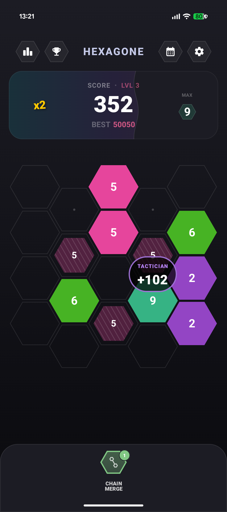
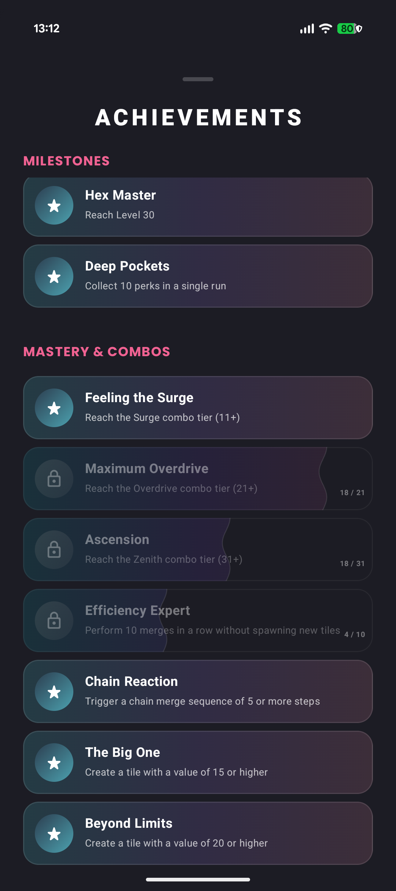
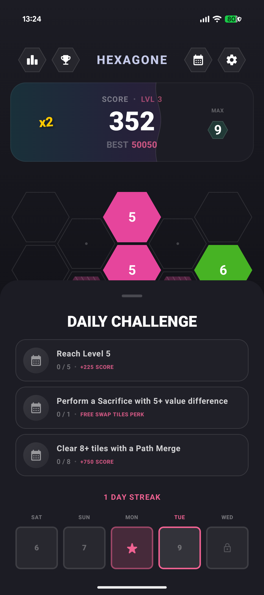
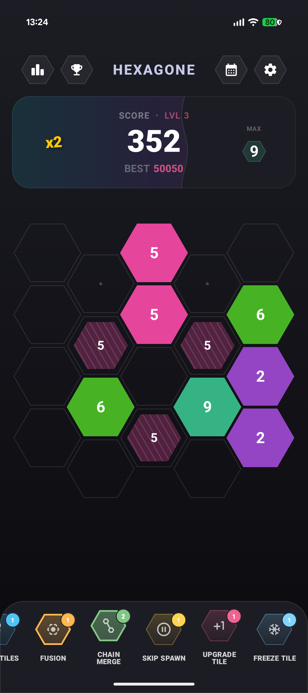
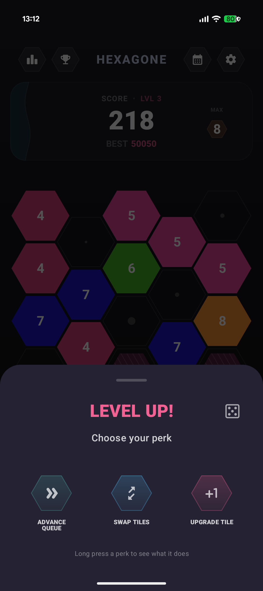
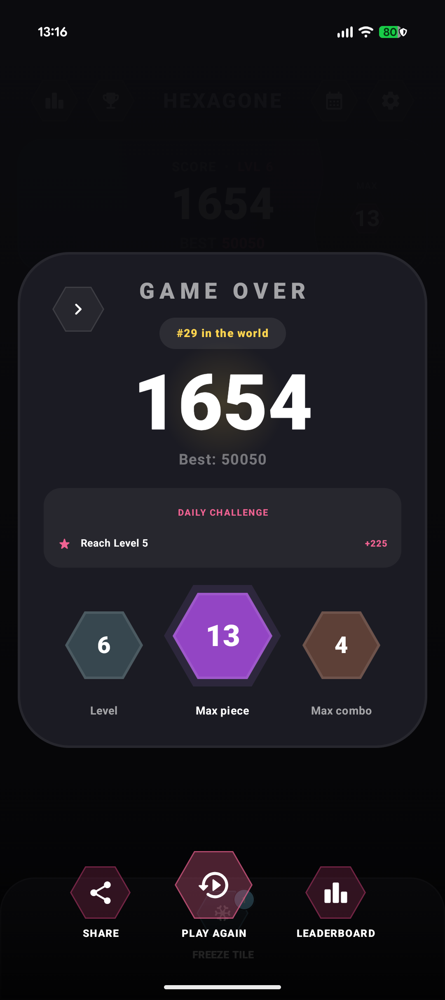

# Hexagone ⬡

**Hexagone** is a high-polish, strategic hexagonal puzzle game built with **Compose Multiplatform**. It combines deep strategic mechanics, a reactive state-driven architecture, and a vibrant "glowing hardware" aesthetic to deliver a premium puzzle experience.

## ✨ Features

- **Strategic Hexagonal Gameplay**: A unique merge system on a staggered flat-top hexagonal grid.
- **Deep Perk Economy**: 15+ unique perks ranging from common "Undo" to legendary "Path Merge" that shift the tide of the game.
- **Dynamic Achievement System**: Over 30 milestones across categories like Spatial Architecture, Strategic Mastery, and Purity.
- **Daily Missions**: Deterministically generated daily challenges with session-specific rewards and persistent streaks.
- **Contextual Onboarding**: An interactive tip system with spotlight effects that guides you through advanced mechanics without friction.
- **Compose Multiplatform**: Shared logic and UI across Android and iOS using Kotlin Multiplatform.
- **Glowing Hardware Aesthetic**: A custom design system leveraging Material 3 roles into a cohesive, neon-inspired visual identity.

## 📸 Screenshots

| Main Game | Achievements | Daily Challenges |
| :---: | :---: | :---: |
|  |  |  |

| Perk Bar | Level Up | Game Over |
| :---: | :---: | :---: |
|  |  |  |

## 🕹️ Core Mechanics

### The Merge Formula
A merge occurs when 2+ tiles of the same value touch. The final value of the merged tile is calculated as:
$$V_{final} = V_{max} + n - k$$
*   `Vmax`: Highest value in the group.
*   `n`: Total number of tiles.
*   `k`: Number of unique value groups involved.

### Tactical Multipliers
Moves involving strategic tile manipulations (Moves, Swaps, or Perk actions) receive a **1.5x base score multiplier**, encouraging advanced planning over simple placement.

### Combo System
Chain merges together to build multipliers up to **x12**. Strategic use of "Chain Merge" and "Fusion" perks can sustain high-scoring streaks.

## 🎨 Visual Identity

- **Liquid HUD**: A progress bar with a dynamic wavy edge that "splashes" based on point intensity.
- **Frost Effect**: Frozen tiles are visually distinct with a themed blue border and a custom snowflake badge.
- **Stable Popups**: HUD notifications use sequential IDs and pre-calculated offsets to ensure animation stability during high-intensity play.
- **Neon-Glow Design**: Mapping Material 3 roles to a custom "Glowing Hardware" palette.

## 🛠️ Tech Stack

- **UI**: Compose Multiplatform (Android/iOS)
- **Architecture**: MVI-inspired with specialized delegates (Merge, Action, Effect, State)
- **DI**: [Koin](https://insert-koin.io/)
- **Persistence**: DataStore with Kotlinx Serialization
- **Concurrency**: Kotlin Coroutines & Flow
- **Animations**: Custom idiomatic Compose animation helpers

## 📁 Project Structure

```text
shared/src/commonMain/kotlin/...
├── achievements/   # Achievement tracking & persistence
├── game/
│   ├── logic/      # Math, scoring, & pattern recognition engine
│   ├── ui/         # Composable screens & "Glowing Hardware" components
│   └── delegates/  # Specialized game state controllers
├── di/             # Koin modules
└── theme/          # Centralized Design System
```

## 🚀 Getting Started

1.  Clone the repository.
2.  Open in Android Studio (Ladybug or newer).
3.  Run the `:androidApp` or `:iosApp` configuration.

---

*Developed by Pointless Games.*
